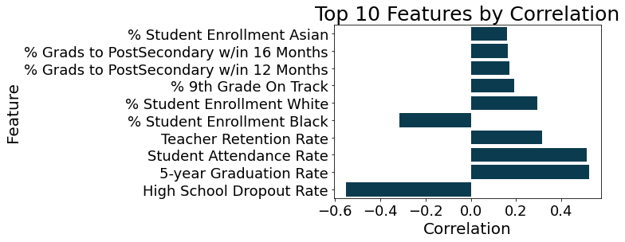
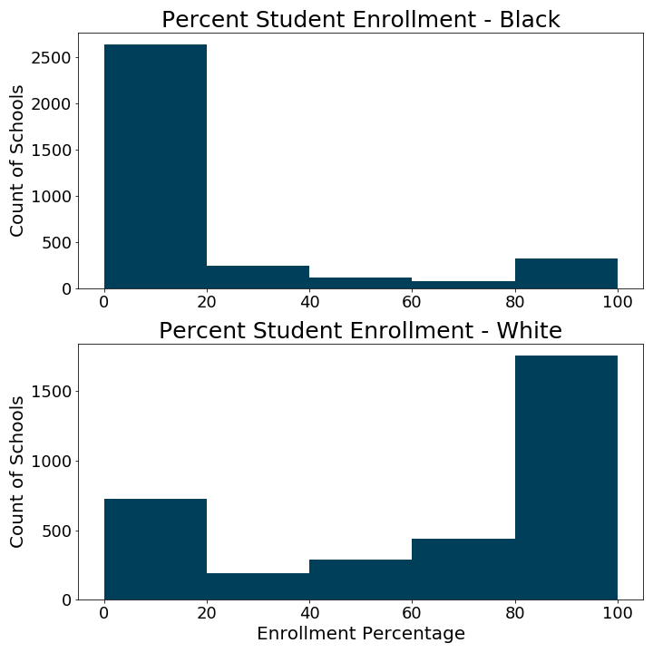
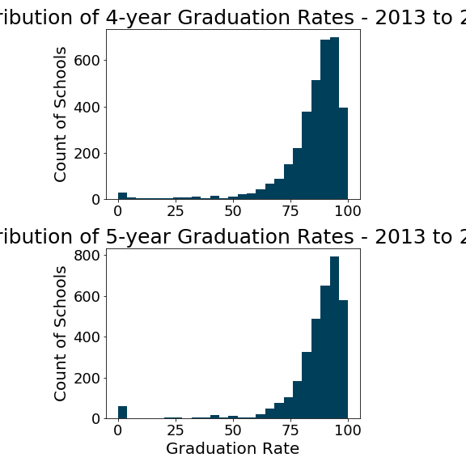
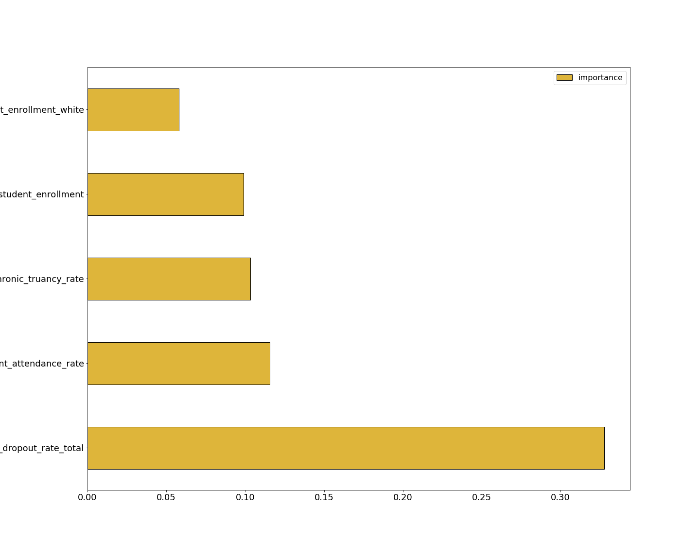

# Predicting High School Graduation Rate with Machine Learning.
Analysis by Dann Morr

## Repo Structure and Directory
- [Report Notebook](https://github.com/dannmorr/predicting-ibse-graduation-rate/blob/master/notebooks/report/final_report.ipynb)
- [Exploratory Notebooks](https://github.com/dannmorr/predicting-ibse-graduation-rate/blob/master/notebooks/exploratory)
- [Project Presentation](https://github.com/dannmorr/predicting-ibse-graduation-rate/blob/master/reports/presentation.pdf)
- [Data](https://github.com/dannmorr/predicting-ibse-graduation-rate/tree/master/data)
- [src/ directory with project source code](https://github.com/dannmorr/predicting-ibse-graduation-rate/tree/master/src)
- [Figures/ directory with project visuals](https://github.com/dannmorr/predicting-ibse-graduation-rate/blob/master/reports/figures)
- [References](https://github.com/dannmorr/predicting-ibse-graduation-rate/tree/master/references)
- [Project environment](https://github.com/dannmorr/predicting-ibse-graduation-rate/blob/master/environment.yml)

## Table of contents:
- [Project Overview](#Project-Overview)
- [Creating an environment from the environment yml file](#Creating-an-environment-from-the-environment-yml-file)
- [Data Source](#Data-Source)
- [Data Cleaning](#Data-Cleaning)
- [Exploratory Data Analysis](#Exploratory-Data-Analysis)
- [First Simple Model](#First-Simple-Model)
- [Model Selection](#Model-Selection) 
- [Final Model Evaluation](#Final-Model-Evaluation)
- [Conclusion](#Conclusion)
- [Future Improvement Ideas](#Future-Improvement-Ideas)
- [Contact](#Contact)

## Project Overview

Improving graduation rates is a constant concern for school district superintendents and administrators. From 2013 to 2019, Illinois’ 4-year high school graduation rates have fluctuated between 83% - 87% (as reported in the [Illinois Report Card Trend Data](https://www.isbe.net/pages/illinois-state-report-card-data.aspx).

The goal of this project is to create a machine learning model that can predict the 4-year graduation rate of a high school cohort based on data regarding the broader structure of the instructional setting and the experience of previous cohorts.

If it is possible to make such a prediction using readily available information it could be possible to provide an additional tool for superintendents to aide in managing their district schools. It could be used to spot performance trends, identify cohorts in need of additional resources, or for school to project target goals for improved academic outcomes.

## Creating an environment from the environment yml file
To run the code in these notebooks, use the terminal or an Anaconda Prompt for the following steps:

Create the environment from the [environment.yml](https://github.com/dannmorr/predicting-ibse-graduation-rate/blob/master/environment.yml) file:
`conda env create -f environment.yml`

The first line of the yml file sets the new environment's name. 

Activate the new environment: 
`conda activate grad-env`

Verify that the new environment was installed correctly:
`conda env list`

## Data Source
Data was gathered from the Illinois State Board of Education's [Illinois Report Card Data Library](https://www.isbe.net/pages/illinois-state-report-card-data.aspx) website. 
From the website: 
>The Report Card Data Library page is the repository for Report Card data available for public use. Here you can find Statewide Trend Data, Report Card Glossary of Terms, and the public data files from which the Report Card is produced annually.

The data for academic years 2018 and 2019 are each available to download in a single .xlsx Data File.

Gathering the data for each of the academic years 2013 - 2017 involves downloading semi-colon separate .txt Data Files and an accompanying Layout File.

Links for all of the downloads are available in the table below.

Cleaned .xlsx versions of the Data Files are contained in the [data folder](https://github.com/dannmorr/predicting-ibse-graduation-rate/tree/master/data) of this repo. 

Copies of the Layout Files are also available in the [references folder](https://github.com/dannmorr/predicting-ibse-graduation-rate/blob/master/references/Open_Illinois_Report_Card_Data_Files.pdf).

| Year | Link to Data File                                                                                      | Link to Layout File                                                               |
|------|--------------------------------------------------------------------------------------------------------|-----------------------------------------------------------------------------------|
| 2019 | https://www.isbe.net/_layouts/Download.aspx?SourceUrl=/Documents/2019-Report-Card-Public-Data-Set.xlsx | n/a                                                                               |
| 2018 | https://www.isbe.net/_layouts/Download.aspx?SourceUrl=/Documents/Report-Card-Public-Data-Set.xlsx      | n/a                                                                               |
| 2017 | https://www.isbe.net/Documents/rc17.zip                                                                | https://www.isbe.net/_layouts/Download.aspx?SourceUrl=/Documents/RC17_layout.xlsx |
| 2016 | https://www.isbe.net/_layouts/Download.aspx?SourceUrl=/Documents/rc16.zip                              | https://www.isbe.net/_layouts/Download.aspx?SourceUrl=/Documents/RC16-layout.xlsx |
| 2015 | https://www.isbe.net/_layouts/Download.aspx?SourceUrl=/Documents/rc15.zip                              | https://www.isbe.net/_layouts/Download.aspx?SourceUrl=/Documents/RC15-layout.xlsx |
| 2014 | https://www.isbe.net/_layouts/Download.aspx?SourceUrl=/Documents/rc14.zip                              | https://www.isbe.net/_layouts/Download.aspx?SourceUrl=/Documents/RC14_layout.xlsx |
| 2013 | https://www.isbe.net/_layouts/Download.aspx?SourceUrl=/Documents/2013-rc-separated.zip                 | https://www.isbe.net/_layouts/Download.aspx?SourceUrl=/Documents/RC13_layout.xlsx |

Instructions for Opening the Report Card Data Files are available in the [references folder](https://github.com/dannmorr/predicting-ibse-graduation-rate/blob/master/references/Open_Illinois_Report_Card_Data_Files.pdf) or can be downloaded [here](https://www.isbe.net/Documents/Open_Illinois_Report_Card_Data_Files.pdf).

>"The Illinois Report Card data files that are available for download from ISBE’s website do not include a header row. You must refer to the companion report card file layout Excel document to understand how the data is organized within the worksheet."

While performing the tasks of downloading the files, and reviewing the contents and Layout Files, I also began to narrow down my selected feature set to use for this project. From the Data Files, I identified 35 features across these 6 categories that I felt would give an adequate holistic view on the students' experience:

**1. General School Information**
 - school_name
 - district
 - city
 - county
 - district_type
 - district_size
 - school_type
 - grades_served
 
**2. Student Demographics**
 - percent_student_enrollment_white
 - percent_student_enrollment_black_or_african_american
 - percent_student_enrollment_hispanic_or_latino
 - percent_student_enrollment_asian
 - percent_student_enrollment_native_hawaiian_or_other_pacific_islander
 - percent_student_enrollment_american_indian_or_alaska_native
 - percent_student_enrollment_two_or_more_races
 - number_student_enrollment
 - total_number_of_school_days
 - student_attendance_rate
 - student_chronic_truancy_rate
 - high_school_dropout_rate_total
 - high_school_4_year_graduation_rate_total
 - high_school_5_year_graduation_rate_total
 
**3. Instructional Setting**
 - avg_class_size_high_school
 
**4. Teacher and Administrator Statistics**
 - pupil_teacher_ratio_high_school
 - teacher_avg_salary
 - teacher_retention_rate
 - principal_turnover_within_6_years
 
**5. College and Career Readiness**
 - percent_graduates_enrolled_in_a_postsecondary_institution_within_16_months
 - percent_graduates_enrolled_in_a_postsecondary_institution_within_12_months
 - percent_9th_grade_on_track
 
**6. Advanced Coursework**
 - number_students_who_took_ap_classes_grade_10_total
 - number_students_who_took_ap_classes_grade_11_total
 - number_students_who_took_ap_classes_grade_12_total

### Inspecting the Data

 Each row in the data sets represents one school in a given academic year. These data sets include all public and charter schools in Illinois serving grades PreK - 12.

The number of columns varied greatly from set to set (from 800 on the low end to 9,000 on the high end), as did the parameters that were recorded from one year to the next. The features listed above were consistently available throughout these data files.

I will use the following cohorts for training the data:

- 2017
- 2016
- 2015
- 2014
- 2013

My validation set will be: 
- 2018

My test set will be 
- 2019

The target variable is **4-year high school graduation rate**.

### Data Cleaning

This is a brief overview of the steps taken to clean the data and combine the files into one working DataFrame.
The details can be seen in [notebooks/exploratory/01_cleaning_and_compiling](https://github.com/dannmorr/predicting-ibse-graduation-rate/blob/master/notebooks/exploratory/01_cleaning_and_compiling.ipynb)

1. Read in each cohort data file and create a DataFrame for schools that serve grades 9 - 12.

    I chose this parameter because there are some charter schools, and schools in smaller districts that serve more grades than 9-12 (and a couple that serve 10-12 or just 11-12. 

    If they serve through grade 12, they submit graduation rate information. If they do not serve grade 12, they do not contain my target variable.
    
2. Convert numeric columns from 'object' to 'float'. Many of the columns had numeric values that were recorded as strings. These were converted to numbers. In some cases this revealed missing values that were replaced with zeros (see next step), others were later imputed with mean values - after performing a train test split. 

3. Fill in NaNs with zeros as appropriate:
    For example, looking at percentages of student demographics, all groups may not be represented and, therefore, cells left blank instead of recording a zero.
    Similarly, not all schools offer Advanced Placement classes for grades 10, 11 and 12. Where these are blank, they have been recorded as zeros.
    
4. Several columns were dropped due to missing values that could not be corrected by zeros or mean values.

## Exploratory Data Analysis 

Looking at the correlation to the target variable of 4-year graduation rates. This heatmap shows correlations to the target variable.

I want to take a closer look at the most significant features by correlation (both positive and negative)

Not surprisingly, features such as 5-year graduation rate, student attendance rate, and teacher retention rate have a strong positive correlation to 4-year graduation. While high school dropout rate has a strong negative correlation.

The correlation between demographic groups and graduation rates is not a comment on race but is an indication of segregation of populations and acceses to resources and funding for schools.

These histograms show that for well over half of the schools Black or African American students make up less than 20% of the population. Also, approximately half of the schools have a student population that is at least 80% White.

That accounts for the correlation values above. There are more schools with both lower numbers of Black or African American students, and higher numbers of White students.

**A note about 4-year vs 5-year graduation**: A student who completes all graduation requirements in the traditional 4-year schedule is included in the 4-year graduation rate total. If a student takes an extra year to complete all graduation requirements they are included in the 5-year graduation rate total. They may graduate in the same year, but are counted separately in the data. 

Looking at the histograms for these two columns, it is obvious why they are highly correlated. There is an almost identical left skewed distribution for each.

It is not that surprising that the rates of graduation for the two populations would be similar at any given school, though.

Upon review, this information causes a data leak. Even though 5-year graduation rate is not the target variable, it contains information that would not be known to anyone running the model to predict an outcome. This feature will have to be removed.

### Final list of features
After dropping the necessary columns, the final list of features will be:

**1. General School Information**
 - school_name
 - district
 - city
 - county
 - district_type
 - district_size
 - school_type
 - grades_served
 
**2. Student Demographics**
 - percent_student_enrollment_white
 - percent_student_enrollment_black_or_african_american
 - percent_student_enrollment_hispanic_or_latino
 - percent_student_enrollment_asian
 - percent_student_enrollment_native_hawaiian_or_other_pacific_islander
 - percent_student_enrollment_american_indian_or_alaska_native
 - percent_student_enrollment_two_or_more_races
 - number_student_enrollment
 - total_number_of_school_days
 - student_attendance_rate
 - student_chronic_truancy_rate
 - high_school_dropout_rate_total
 - high_school_4_year_graduation_rate_total
 
**3. Instructional Setting**
 - avg_class_size_high_school
 
**4. Teacher and Administrator Statistics**
 - teacher_retention_rate
 
**5. College and Career Readiness**
 - percent_graduates_enrolled_in_a_postsecondary_institution_within_16_months
 - percent_graduates_enrolled_in_a_postsecondary_institution_within_12_months
 - percent_9th_grade_on_track
 
**6. Advanced Coursework**
*none*

## First Simple Model

I used a basic OLS Linear Regression to set a base line using [this forward selected function](#https://planspace.org/20150423-forward_selection_with_statsmodels/) to select the numeric features only.
   
  >"It tries to optimize Adjusted R-squared by adding features that help the most one at a time until the score goes down or you run out of features."

This model returned an Adjusted R-squared value of 0.376, indicating that less than 50% of the variance in the target variable is predictable from the features. This was the baseline model, did not include any of the categorical features, and there was no feature engineering or hyperparameter tuning. That leaves me feeling optimistic that I can improve on this with all of the above.

The p-values for several of the "Top 10 Features by Correlation" is at or close to 0.00, indicating these features are meaningful to the model. This includes:
**High School Dropout Rate
Percent of 9th Graders on Track
Student Attendance Rate**

The values for **Percent of Graduates Enrolled in PostSecondary Education (both 16-month and 12-month)** are also very low, 0.005 and 0.018 respectively. These features also are meaningful... although less so than those above.

The values for demographic features **Percent Student Enrollment by...** have significantly higher p-value scores ranging from 0.588 to 0.964, indicating that these features are not actually statisically significant.

## Model selection
For model selection, I decided to compare several models on their default settings and the same random state (19).

The models I chose are 
- Linear Regression
- Random Forest Regressor
- Extra Trees Regressor
- Lasso
- Ridge
- Gradient Boosting Regressor
- Support Vector Regressor
- K-Nearest Neighbor Regressor

The results are plotted below.

Gradient Boosting returned the highest Adjusted R-squared value: 0.506.

I then employed RandomizedSearchCV to determine the optimal settings for the hyperparameters.
#### The model returned an Adjusted R-squared value of 0.540.

## Final Model Evaluation

#### The final model returned an Adjusted R-squared value of 0.565.
That is a surprisingly good result on the test data. The Adjusted R-squared values have been steadily increasing throughout this process, as seen in the chart below:

| Model                                         | Evaluated on   | Adjusted R-Squared Score |
|-----------------------------------------------|----------------|-----------------|
| Ordinary Least Squares  Linear Regression     | Validation set | 0.376           |
| Gradient Boosting Regressor (default setting)   | Validation set | 0.506           |
| Gradient Boosting Regressor (optimized setting) | Validation set | 0.540           |
| Gradient Boosting Regressor (optimized setting) | Test set       | 0.565           |

From the First Simple Model to the Final Model there was an increase of approximately 19 percentage points.
This indicates that the model is improving at each iteration.
Although the Adjusted R-squared values are increasing, there are no giant leaps that suggest overfitting.

Upon reviewing the feature importances of the final model, I notice that it does bear a similarity to the "Top 10 Features by Correlation" from above. "High School Dropout Rate", and "Student Attendance Rate" are the top 2 in both plots.

"Student Attendance Rate" surely have a positive correlation here, and "High School Dropout Rate" a negative correlation to predicting the 4-year graduation rate.

In the case of the other two features in this chart - "Number of Student Enrollment" and "Chronic Student Truancy Rate". They are probably significant in postive and negative ways, respectively.

The greater the number of students in a school would increase the probability of students graduating overall. Conversely, the higher the truancy rate at a school, the lower the graduation rate will be. 

The "Percent Student Enrollment White" feature I addressed above, and its inclusion here makes me reconsider my use of demographic informatino as a predictor, since that is not something that can be applied in the real world. 

## Conclusion

At this point, I feel this result is a "proof of concept" for the project. The Adjusted R-squared value of 0.565 on the final model does not satisfy me that it could be used for predictions in the real world at this time. However, there is still the possibility of building upon this start and attempting to improve its' ability.

If I could get an Adjusted R-squared above 0.800, it could be a useful tool for administrators and superinendents to implement in managing their schools.

## Future Improvement Ideas

Some ideas I would like to pursue to improve this model include:

- additional feature engineering and feature selection
I would like to reassess some of the features that I eliminated in EDA.
Perhaps it would be possible to find more about the missing values, include some of the data recorded at the district level, and possibly look at including financial, tax, or census information for the districts and/or counties.

- optimizing some of the other models I tried during selection.
Gradient Boosting returned the highest value in the default state, but it is possible that one or more of the other models could return a better Adjusted R-squared score after tuning the hyperparameters.

- new code for data cleaning
As a side note to the model building: If I join more data sources, I would like to work on some code to gather and compile data more elegantly and efficiently.

## Contact

#### Dann Morr [GitHub](https://github.com/dannmorr) | [LinkedIn](https://linkedin.com/in/dannmorr) | [Medium](https://medium.com/@dannmorr) | [Email](mailto:dannmorr@gmail.com)
